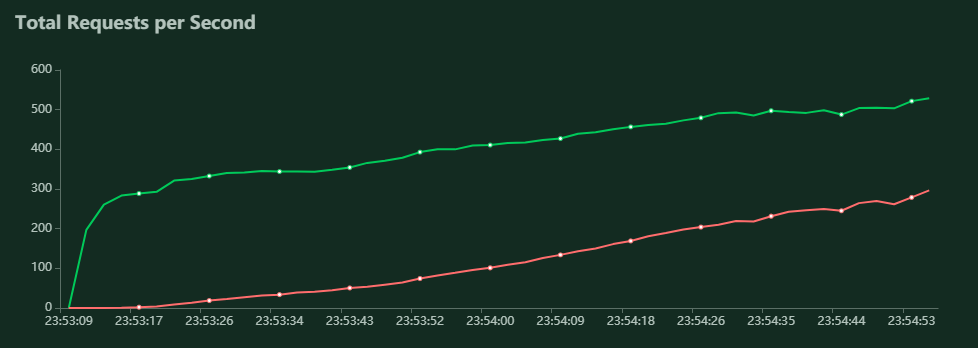
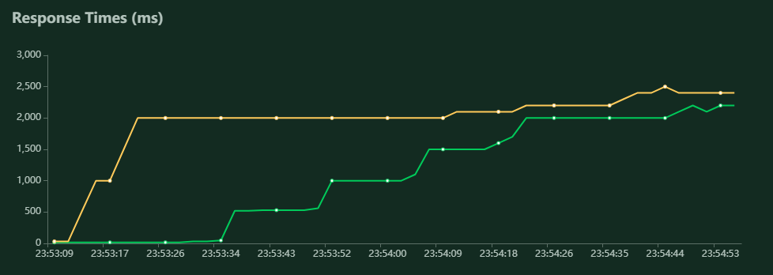
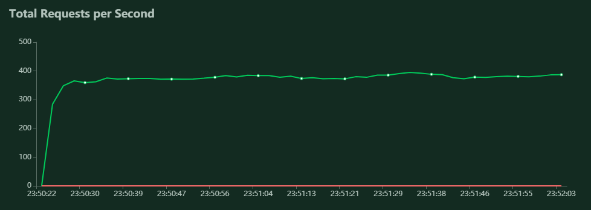

# Creating NLU API for intent classification

## This repo contains multiple notebooks and scripts dealing with the problematics we faced while creating an NLU API for intent classification.

### Q1. Analysing the training and evaluation data.

In this part we analyse the training and testing sets.
The goal here is to visualise the distributions of each class in order to get a better understanding of our data.

Check this notebook : [Q1_data_analysis.ipynb](Q1_data_analysis.ipynb)

### Q2. Evaluating a pretrained model.

In order to evaluate the performance of the model in provided docker image,
we created a python notebook that calls the api using the sentences from the [testing set](data/testing_set.json)
and stores the responses in the file [testing_model_predictions.json](data/testing_model_predictions.json)

Check this notebook : [Q1_evaluating_model.ipynb](Q1_evaluating_model.ipynb)

### Q3. Training and testing our own pipeline using spaCy.

We chose to use spaCy for our intent classification model.

The training script is in this notebook : [Q3_Train_SpaCy_Model.ipynb](Q3_Train_SpaCy_Model.ipynb)

The evaluation script is in this notebook : [Q3_Test_SpaCy_Model.ipynb](Q3_Test_SpaCy_Model.ipynb)

After running the training for 100 epochs these are the results

Training results
```
LOSS       P        R        F1
0.096    0.860    0.857    0.858
```

Evaluation results
```
  P  	  R  	  F1
0.826	0.824	0.825
```

### Q4. Using FastAPI web framework to provide APIs to our intention model.

We chose to deploy our model using FastAPI since it proved to be better performing than other models.
Check [here](# Performance testing Flask vs Bottle vs Fast API.) for our API benchmarks

The docker image is available on DockerHub: [link](https://hub.docker.com/repository/docker/csj0oe/mlops-wiidii)

Build docker image
```shell
docker build --tag intentclassication .
```

Run docker image
```shell
docker run -d -p 8000:8000 intentclassication
```

Server is now listening on http://localhost:8000.

- To check documentation of the API, check [http://localhost:8000/docs](http://localhost:8000/docs)
- To test the API, check [http://localhost:8000/api/intent?sentence=une%phrase](http://localhost:8000/api/intent/?sentence=J%27ai%20besoin%20d%27un%20restaurant%20italien%20pour%20ce%20soir,%20nous%20serons%204%20convives)


# Performance testing Flask vs Bottle vs Fast API.

In order to test the performance of the API under load, we used [Locust](https://locust.io/) as a testing tool.


We configured Locust to simulate 1000 users with spawn rate equals to 10 users per second.

```
Spawn rate = 10 users/second
Number Users = 1000
```

The APIs we are testing use different standard:

* WSGI stands for Web Server Gateway Interface
* ASGI stands for Asynchronous Server Gateway Interface


| Flask | Bottle | Fast API |
|:-:|:-:|:-:|
| WSGI| WSGI | ASGI using [Uvicorn](https://www.uvicorn.org/) |

## Results

|| Total Requests Per Second | Response Time |
|:-:|:-------------------------:|:-------------------------:|
| Flask |   |  | 
|Flask|- The number of requests per second is hovering arround 300 rps <br /> - The percentage of failed requests is very high arround 62%|- Median response time is arround 2300ms <br /> - The Top95 curve and median curve are very far which means that the QoS variance is very high. <br /> - The delay varies alot from user to user. <br /> - Some users experience very big delays 7000ms|
| Bottle |  |  |
|Bottle|- The rps is gradualy increasing from 300 arround 600 rps <br /> - The percentage of failed requests is also increasing reaching 37%|- Median response time is arround 2200ms <br /> - The Top95 curve and median curve are far when the number of users is small. <br /> - The median curve increaces while the Top95 curve remains constant. <br /> - This is mostly due to a timeout delay which constrains the response time.  <br /> - This also explains the increase in the number of failed requests |
| Fast API |  |  | 
|Fast API|- The number of requests per second is relatively constant arround 360 rps <br /> - The percentage of failed requests is 0%|- Median response time is arround 2300ms <br /> - The Top95 curve and median curve are very close which means that the QoS variance is very small. <br /> - All users have the same latency.|


## Conclusion:


`Fast API` in combination with `uvicorn` yielded the best performance during the load tests:

* Very high number of requests per second
* Zero failed requests
* Uniform QoS accross all users

## Further testing

However, we wanted to push the server to its limits and we used the following configuration:

```
Spawn rate = 50 users/second
Number Users = 5000
```

The Fast API started to yield very bad results at arround 2500 users, but not because of the bad API, but because it crashed due to our system limitations.

| Total Requests Per Second | Response Time |
|:-------------------------:|:-------------------------:|
|   |  | 


```shell
File "Q4_fast_api_server.py", line 24, in <module>
    uvicorn.run(app, host=config['HOST'], port=config['PORT'], debug=config['DEBUG'], reload=False, access_log=False)
File "C:\Users\me\anaconda3\envs\mlops\lib\site-packages\uvicorn\main.py", line 386, in run
    server.run()
File "C:\Users\me\anaconda3\envs\mlops\lib\site-packages\uvicorn\server.py", line 48, in run
    loop.run_until_complete(self.serve(sockets=sockets))
File "C:\Users\me\anaconda3\envs\mlops\lib\asyncio\base_events.py", line 475, in run_until_complete
    self.run_forever()
File "C:\Users\me\anaconda3\envs\mlops\lib\asyncio\base_events.py", line 442, in run_forever
    self._run_once()
File "C:\Users\me\anaconda3\envs\mlops\lib\asyncio\base_events.py", line 1426, in _run_once
    event_list = self._selector.select(timeout)
File "C:\Users\me\anaconda3\envs\mlops\lib\selectors.py", line 323, in select
    r, w, _ = self._select(self._readers, self._writers, [], timeout)
File "C:\Users\me\anaconda3\envs\mlops\lib\selectors.py", line 314, in _select
    r, w, x = select.select(r, w, w, timeout)
ValueError: too many file descriptors in select()
```
